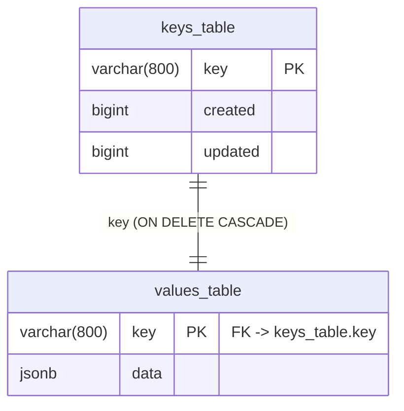

# nopog

[](https://github.com/benitogf/nopog/actions/workflows/tests.yml)

Multi-table key-value store using PostgreSQL with JSON column type as value.

**Requires PostgreSQL 11+** for the `^@` prefix matching operator.

## Schema

Each table is a pair: `keys_<table>` holds the key and its timestamps, `values_<table>` holds the JSON payload. A row in `values_<table>` references its key in `keys_<table>`, and deleting the key cascades to the value.



## Features

- **Multi-table support**: Create multiple isolated table pairs (keys_X, values_X)
- **Glob pattern matching**: Single `*` at end of path for prefix queries
- **Optimized range queries**: Dedicated SQL functions filter keys by prefix AND time range before joining
- **SP-GiST index**: For fast `^@` prefix matching operator
- **Batch inserts**: `SetBatch` for high-throughput bulk writes (~4,000+ entries/sec)
- **Automatic retry**: Connection and ping retry with configurable max retries

## Timestamps

Timestamps (`created`, `updated`) are `bigint` **microseconds since the Unix epoch** (µs).

Microsecond resolution is a deliberate choice for JavaScript/browser consumers: an epoch-µs value stays below `Number.MAX_SAFE_INTEGER` (2^53 − 1, safe until roughly the year 2255), so it round-trips through JSON and browser number handling without loss. Epoch-**nanoseconds** would exceed that bound today and silently corrupt when parsed as a JavaScript number.

**Tie semantics:** timestamps are not guaranteed to be distinct — two writes within the same microsecond can share an equal `created` value. All ordered reads and pagination cursors therefore tiebreak deterministically by `key`: ordering is by `(created, key)`, so equal timestamps produce a stable, repeatable order.

## Interface

```go
type Object struct {
    Created int64           `json:"created"`
    Updated int64           `json:"updated"`
    Key     string          `json:"key"`
    Value   json.RawMessage `json:"value"`
}

type Storage struct {
    Name       string
    User       string
    Password   string
    SSLMode    string
    Host       string
    Port       string
    MaxRetries int // Maximum connection retries (default 120)

    MaxOpenConns    int           // Maximum open connections (default 50)
    MaxIdleConns    int           // Maximum idle connections (default 25)
    ConnMaxLifetime time.Duration // Connection max lifetime (default 5 minutes)
    ConnMaxIdleTime time.Duration // Connection max idle time (default 1 minute)
}

// Connection
Start() error
Close()

// Table management
CreateTable(table string) error
DropTable(table string) error
Clear(table string)

// Read operations
Keys(table string) ([]string, error)
KeysRange(table, path string, from, to int64, limit int) ([]string, error)
Get(table, path string) ([]Object, error)  // Single trailing-glob prefix or exact key
GetN(table, path string, limit int) ([]Object, error)
GetNRange(table, path string, from, to int64, limit int) ([]Object, error)
GetRange(table, path string, from, to int64) ([]Object, error)
GetByJSON(table, path, jsonFilter string) ([]Object, error)  // JSONB containment query
GetByField(table, path, fieldName, fieldValue string) ([]Object, error)  // JSONB field query
Scan(table string, cursorCreated int64, cursorKey string, limit int) ([]Object, error)  // keyset pagination
GetRangeSegment(table, path string, from, to int64, limit int, positions []int, value string) ([]Object, error)  // range + path-segment filter

// Write operations
Set(table, key, value string) (int64, error)
SetWithMeta(table, key, value string, created, updated int64) error  // upsert with caller-supplied timestamps
SetBatch(table string, keys []string, values []string) ([]int64, error)
ImportBatch(table string, entries []Object) (inserted int, err error)  // additive bulk insert, never overwrites
Del(table, path string) error

// Monitoring
TableStats(table string) (*TableStatistics, error)  // Row count and size for partitioning decisions
```

**Limit convention:** every read that takes a `limit` (`GetN`, `GetNRange`, `KeysRange`, `Scan`, `GetRangeSegment`) treats a `limit <= 0` as "no limit" — all matching rows. `GetRange` has no `limit` parameter and always returns everything in range.

### SetWithMeta

```go
SetWithMeta(table, key, value string, created, updated int64) error
```

Upsert that overwrites `created` and `updated` with caller-supplied µs values instead of stamping the current time. Use it for restore and replication, where the original timestamps must be preserved rather than regenerated.

### ImportBatch

```go
ImportBatch(table string, entries []Object) (inserted int, err error)
```

Additive bulk insert. Existing keys are never overwritten (`ON CONFLICT DO NOTHING`); only rows whose keys are not already present are written. Returns the count of rows actually inserted.

### Scan

```go
Scan(table string, cursorCreated int64, cursorKey string, limit int) ([]Object, error)
```

Keyset pagination over `(created, key)` in ascending order. Pass the previous page's last row `created` and `key` as `cursorCreated`/`cursorKey` to fetch the next page; pass the zero cursor for the first page. A `limit <= 0` means no limit (all rows after the cursor). Because ordering tiebreaks by `key`, pagination is stable even when timestamps collide.

### GetRangeSegment

```go
GetRangeSegment(table, path string, from, to int64, limit int, positions []int, value string) ([]Object, error)
```

Range query with a path-segment equality filter. Matches keys within the inclusive `[from, to]` time window (`created >= from AND created <= to`) whose path segment at **any** position listed in `positions` equals `value`. A `to` of `0` is treated as "now" (consistent with `GetNRange`/`GetRange`), and a `limit` of `0` (or negative) means "no limit" — all matching rows in range. For example, `positions` `{3, 4}` with `value` `"42"` matches keys where an id may sit at segment 3 or at segment 4 across two key layouts.

## Schema export

The canonical `nopog.sql` is embedded into the package via `//go:embed` and exposed as:

```go
nopog.SchemaSQL // string — the embedded contents of nopog.sql
```

Downstream images can vendor `nopog.SchemaSQL` and guard against drift with a test that compares their copy against it, instead of hand-copying the schema.

## Quickstart

### 1. Setup database

Create a fresh database in your PostgreSQL server, then apply the schema. Either apply the [sql script](nopog.sql) directly:

```bash
psql -f nopog.sql
```

or run the installer with the same connection flags:

```bash
go run ./install -host=localhost -user=postgres -password=postgres -dbname=postgres
```

The schema targets **fresh databases only** — there is no upgrade path from the previous single-table schema. Install into a new database.

### 2. Install

```bash
go get github.com/benitogf/nopog
```

### 3. Usage

```go
storage := &nopog.Storage{
    Name:     "postgres",
    Host:     "localhost",
    User:     "postgres",
    Password: "postgres",
}

// Start with automatic retry and ping verification
err := storage.Start()
if err != nil {
    log.Fatal(err)
}
defer storage.Close()

// Create a table
err = storage.CreateTable("mydata")

// Set values
ts, err := storage.Set("mydata", "users/1", `{"name":"Alice"}`)
ts, err = storage.Set("mydata", "users/2", `{"name":"Bob"}`)

// Get single key
results, err := storage.Get("mydata", "users/1")

// Get with glob pattern (single * at end)
results, err = storage.Get("mydata", "users/*")

// Get with time range
results, err = storage.GetNRange("mydata", "users/*", fromTimestamp, toTimestamp, 100)

// Delete
err = storage.Del("mydata", "users/1")
err = storage.Del("mydata", "users/*") // Delete all matching pattern
```

## Key Patterns

### Prefix glob (single trailing `*`)

Only a single `*` at the end of the path is supported:

- `users/1` - exact key match
- `users/*` - all keys under the `users/` prefix
- `users/admin/*` - all keys under the `users/admin/` prefix
- `*` - all keys

**Prefix matching returns ALL depths below the prefix.** End your prefix at a `/` to avoid sibling-family bleed: `a/` matches only children of `a`, whereas `a` (no trailing slash) would also match sibling families like `ab`.

Keys may contain letters, digits, and the separators `/`, `-`, `_`, `.` (plus a single trailing `*` for globs). Separators are allowed only in the middle of a key — a key must start and end with a letter, digit, or `*`. This matches the key character set of [`benitogf/ooo`](https://github.com/benitogf/ooo).

Invalid patterns (return an error):

- `users/**` - double glob
- `users//test` - double separator
- `stats/*/clicks/*` - multiple `*`
- `users/*/profile` - mid-path `*`
- `-users` / `users.` - starts or ends with a separator

## Performance

### Indexes

Each table pair uses the following optimized indexes:

| Index | Type | Purpose |
|-------|------|---------|
| `keys_<table>_pkey` | B-tree | Primary key lookups |
| `idx_keys_<table>_created` | B-tree DESC | Time range filtering (most used) |
| `idx_keys_<table>_key_spgist` | SP-GiST | `^@` prefix matching operator |
| `idx_keys_<table>_key_created` | B-tree composite | Combined prefix + time range queries |

### Query Optimization

Range queries (`GetNRange`, `GetRange`, `KeysRange`) use dedicated SQL functions that:
1. Filter keys by prefix AND time range in a single WHERE clause
2. Use the composite index for efficient filtering
3. LEFT OUTER JOIN to values table only for matching rows

This approach is **32x faster** than filtering after join for small time windows.

### Batch Inserts

Use `SetBatch` for bulk writes:

```go
keys := []string{"data/1", "data/2", "data/3"}
values := []string{`{"a":1}`, `{"a":2}`, `{"a":3}`}
timestamps, err := storage.SetBatch("mydata", keys, values)
```

Batch inserts achieve **~4,000+ entries/sec** vs ~750 entries/sec for individual inserts.

### Benchmark Results (100k entries)

| Operation | Time |
|-----------|------|
| `GetNRange` (100 results, small window) | ~4ms |
| `KeysRange` (100 results, small window) | ~1.3ms |
| `Get` (single key) | <1ms |
| Batch insert (1000 entries) | ~240ms |

## Test Coverage

Run tests with:
```bash
go test -v -race -timeout 30s
go test -cover
```

## Troubleshooting

### PostgreSQL version

This library requires **PostgreSQL 11+** for the `^@` starts-with operator.
