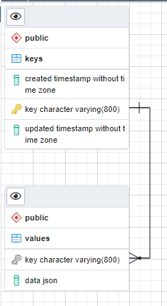

# nopog

[](https://github.com/benitogf/nopog/actions/workflows/tests.yml)

Multi-table key-value store using PostgreSQL with JSON column type as value.

**Requires PostgreSQL 11+** for the `^@` prefix matching operator.

## Schema



## Features

- **Multi-table support**: Create multiple isolated table pairs (keys_X, values_X)
- **Monotonic timestamps**: Guaranteed strictly increasing timestamps (microseconds)
- **Glob pattern matching**: Single `*` at end of path for prefix queries
- **Optimized range queries**: Dedicated SQL functions filter keys by prefix AND time range before joining
- **SP-GiST index**: For fast `^@` prefix matching operator
- **Batch inserts**: `SetBatch` for high-throughput bulk writes (~3000+ entries/sec)
- **Automatic retry**: Connection and ping retry with configurable max retries

## Interface

```go
type Object struct {
    Created int64           `json:"created"`
    Updated int64           `json:"updated"`
    Key     string          `json:"key"`
    Value   json.RawMessage `json:"value"`
}

type Storage struct {
    Name       string
    User       string
    Password   string
    SSLMode    string
    Host       string
    Port       string
    MaxRetries int // Maximum connection retries (default 120)
}

// Connection
Start() error
Close()

// Table management
CreateTable(table string) error
DropTable(table string) error
Clear(table string)

// Read operations
Keys(table string) ([]string, error)
KeysRange(table, path string, from, to int64, limit int) ([]string, error)
Get(table, path string) ([]Object, error)  // Supports single-glob and multi-glob patterns
GetN(table, path string, limit int) ([]Object, error)
GetNRange(table, path string, from, to int64, limit int) ([]Object, error)
GetRange(table, path string, from, to int64) ([]Object, error)
GetByJSON(table, path, jsonFilter string) ([]Object, error)  // JSONB containment query
GetByField(table, path, fieldName, fieldValue string) ([]Object, error)  // JSONB field query

// Write operations
Set(table, key, value string) (int64, error)
SetBatch(table string, keys []string, values []string) ([]int64, error)
Del(table, path string) error

// Monitoring
TableStats(table string) (*TableStatistics, error)  // Row count and size for partitioning decisions
```

## Quickstart

### 1. Setup database

Create a database in your PostgreSQL server and run the migration:

```bash
go run ./migrate/main.go -host=localhost -user=postgres -password=postgres -dbname=postgres
```

Or run the [sql script](nopog.sql) directly.

### 2. Install

```bash
go get github.com/benitogf/nopog
```

### 3. Usage

```go
storage := &nopog.Storage{
    Name:     "postgres",
    Host:     "localhost",
    User:     "postgres",
    Password: "postgres",
}

// Start with automatic retry and ping verification
err := storage.Start()
if err != nil {
    log.Fatal(err)
}
defer storage.Close()

// Create a table
err = storage.CreateTable("mydata")

// Set values
ts, err := storage.Set("mydata", "users/1", `{"name":"Alice"}`)
ts, err = storage.Set("mydata", "users/2", `{"name":"Bob"}`)

// Get single key
results, err := storage.Get("mydata", "users/1")

// Get with glob pattern (single * at end)
results, err = storage.Get("mydata", "users/*")

// Get with time range
results, err = storage.GetNRange("mydata", "users/*", fromTimestamp, toTimestamp, 100)

// Delete
err = storage.Del("mydata", "users/1")
err = storage.Del("mydata", "users/*") // Delete all matching pattern
```

## Key Patterns

### Single-Glob (Fast, uses prefix index)

- `users/1` - exact key match
- `users/*` - all keys starting with `users/`
- `users/admin/*` - all keys starting with `users/admin/`
- `*` - all keys

### Multi-Glob (Slower, uses regex matching)

- `stats/*/clicks/*` - match nested patterns
- `users/*/profile` - wildcard in middle
- `a/*/b/*/c` - multiple wildcards

Multi-glob patterns are auto-detected and routed to regex-based matching.

**Note:** Prefix matching returns all descendants. Multi-glob uses `[^/]+` regex (matches any segment).

Invalid patterns (will return error):
- `users/**` - double glob
- `users//test` - double separator

## Performance

### Indexes

Each table pair uses the following optimized indexes:

| Index | Type | Purpose |
|-------|------|---------|
| `keys_<table>_pkey` | B-tree | Primary key lookups |
| `idx_keys_<table>_created` | B-tree DESC | Time range filtering (most used) |
| `idx_keys_<table>_key_spgist` | SP-GiST | `^@` prefix matching operator |
| `idx_keys_<table>_key_created` | B-tree composite | Combined prefix + time range queries |

### Monotonic Timestamps

Uses a cached PostgreSQL sequence with hybrid approach for high-performance monotonic timestamps:

```sql
SELECT GREATEST(nextval('monotonic_clock_seq'), extract(epoch from clock_timestamp()) * 1000000)
```

- **CACHE 1000**: Sequence values cached in memory, minimal disk I/O
- **Hybrid approach**: Maintains time correlation while guaranteeing monotonicity
- **~50,000+ calls/sec**: Compared to ~1,000/sec with table-based approach

### Query Optimization

Range queries (`GetNRange`, `GetRange`, `KeysRange`) use dedicated SQL functions that:
1. Filter keys by prefix AND time range in a single WHERE clause
2. Use the composite index for efficient filtering
3. LEFT OUTER JOIN to values table only for matching rows

This approach is **32x faster** than filtering after join for small time windows.

### SQL Function Optimization

- `valid()` and `monotonic_now()` use `LANGUAGE sql` instead of `LANGUAGE plpgsql` for reduced overhead
- `valid()` marked as `IMMUTABLE` for query planner optimization

### Batch Inserts

Use `SetBatch` for bulk writes:

```go
keys := []string{"data/1", "data/2", "data/3"}
values := []string{`{"a":1}`, `{"a":2}`, `{"a":3}`}
timestamps, err := storage.SetBatch("mydata", keys, values)
```

Batch inserts achieve **~4,000+ entries/sec** vs ~750 entries/sec for individual inserts.

### Benchmark Results (100k entries)

| Operation | Time |
|-----------|------|
| `GetNRange` (100 results, small window) | ~4ms |
| `KeysRange` (100 results, small window) | ~1.3ms |
| `Get` (single key) | <1ms |
| Batch insert (1000 entries) | ~240ms |

## Test Coverage

Current test coverage: **75.7%**

Run tests with:
```bash
go test -v -race -timeout 30s
go test -cover
```

## Troubleshooting

### PostgreSQL version

This library requires **PostgreSQL 11+** for the `^@` starts-with operator.
